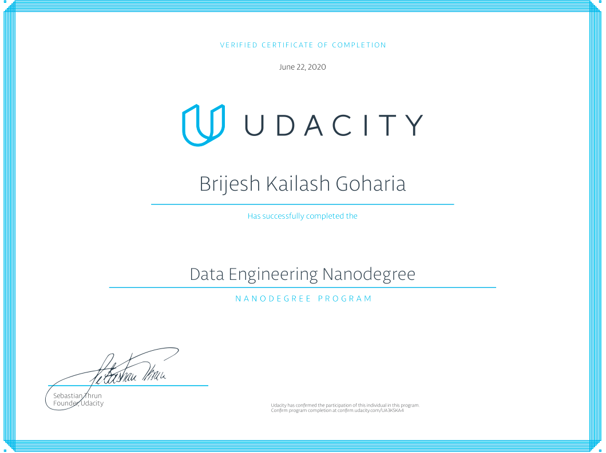

# Data Engineering Nanodegree
## Certificate of completion

Projects and resources developed in the [DEND Nanodegree](https://github.com/brijeshgoharia/Data-Engineering) from Udacity.

## Project 1: [Relational Databases - Data Modeling with PostgreSQL](https://github.com/brijeshgoharia/Data-Engineering/tree/dev/Project1-POSTGRESQL).
Developed a relational database using PostgreSQL to model user activity data for a music streaming app. Skills include:
* Created a relational database using PostgreSQL
* Developed a Star Schema database using optimized definitions of Fact and Dimension tables. Normalization of tables.
* Built out an ETL pipeline to optimize queries in order to understand what songs users listen to.

Proficiencies include: Python, PostgreSql, Star Schema, ETL pipelines, Normalization

## Project 2: [NoSQL Databases - Data Modeling with Apache Cassandra](https://github.com/brijeshgoharia/Data-Engineering/tree/dev/Project2-CASSANDRA).
Designed a NoSQL database using Apache Cassandra based on the original schema outlined in project one. Skills include:
* Created a nosql database using Apache Cassandra (both locally and with docker containers)
* Developed denormalized tables optimized for a specific set queries and business needs

Proficiencies used: Python, Apache Cassandra, Denormalization

## Project 3: [Data Warehouse - Amazon Redshift](https://github.com/brijeshgoharia/Data-Engineering/tree/dev/Project3-DATAWAREHOUSE_REDSHIFT).
Created a database warehouse utilizing Amazon Redshift. Skills include:
* Creating a Redshift Cluster, IAM Roles, Security groups.
* Develop an ETL Pipeline that copies data from S3 buckets into staging tables to be processed into a star schema
* Developed a star schema with optimization to specific queries required by the data analytics team.

Proficiencies used: Python, Amazon Redshift, aws cli, Amazon SDK, SQL, PostgreSQL

## Project 4: [Data Lake - Spark](https://github.com/brijeshgoharia/Data-Engineering/tree/dev/Project4-Data_Lake)
Scaled up the current ETL pipeline by moving the data warehouse to a data lake. Skills include:
* Create an EMR Hadoop Cluster
* Further develop the ETL Pipeline copying datasets from S3 buckets, data processing using Spark and writing to S3 buckets using efficient partitioning and parquet formatting.
* Fast-tracking the data lake buildout using (serverless) AWS Lambda and cataloging tables with AWS Glue Crawler.

Technologies used: Spark, S3, EMR, Athena, Amazon Glue, Parquet.

## Project 5: [Data Pipelines - Airflow](https://github.com/brijeshgoharia/Data-Engineering/tree/dev/Project5-DATA_AIRFLOW)
Automate the ETL pipeline and creation of data warehouse using Apache Airflow. Skills include:
* Using Airflow to automate ETL pipelines using Airflow, Python, Amazon Redshift.
* Writing custom operators to perform tasks such as staging data, filling the data warehouse, and validation through data quality checks.
* Transforming data from various sources into a star schema optimized for the analytics team's use cases.

Technologies used: Apache Airflow, S3, Amazon Redshift, Python.

## Project 6: [Capstone](https://github.com/brijeshgoharia/Data-Engineering/tree/dev/Capstone)
* The purpose of this project is to process Covid-19 data in an attempt to analyze & visualize the data to derive statistical information & study patterns in Covid cases in the USA & worldwide.

